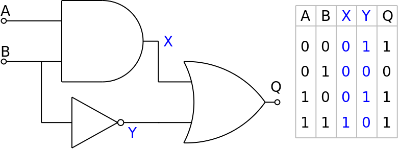

# zkSNARK Circuit
This is a zkSnark circuit designed to verify a particular logic gate operation and generate zero-knowledge circuits, proofs, and solidity verifiers

## Deployment
### Installation
To install the necessary dependencies, run `npm i` in your project directory.

### Compilation
Compile the project by running `npx hardhat circom`. This will generate the `out` directory containing circuit intermediaries and the `LogicGateCircuitVerifier.sol` contract.

### Proof Generation and Deployment

Use the command `npx hardhat run scripts/deploy.ts` to execute the deployment script. This script performs the following tasks:

1. Deploys the `LogicGateCircuitVerifier.sol` contract on the blockchain.
2. Generates a proof using circuit intermediaries with the `generateProof()` function.
3. Creates calldata for the verification process using the `generateCallData()` function.
4. Calls the `verifyProof()` method on the deployed Verifier contract with the generated calldata to verify the proof.

By running this script, you will deploy the Verifier contract and verify the proof against the circuit, ensuring the correctness of your implementation.

You can also use the command `npx hardhat run scripts/deploy.ts --network mumbai` to execute the deployment on polygon chain using polygon mumbai network.
